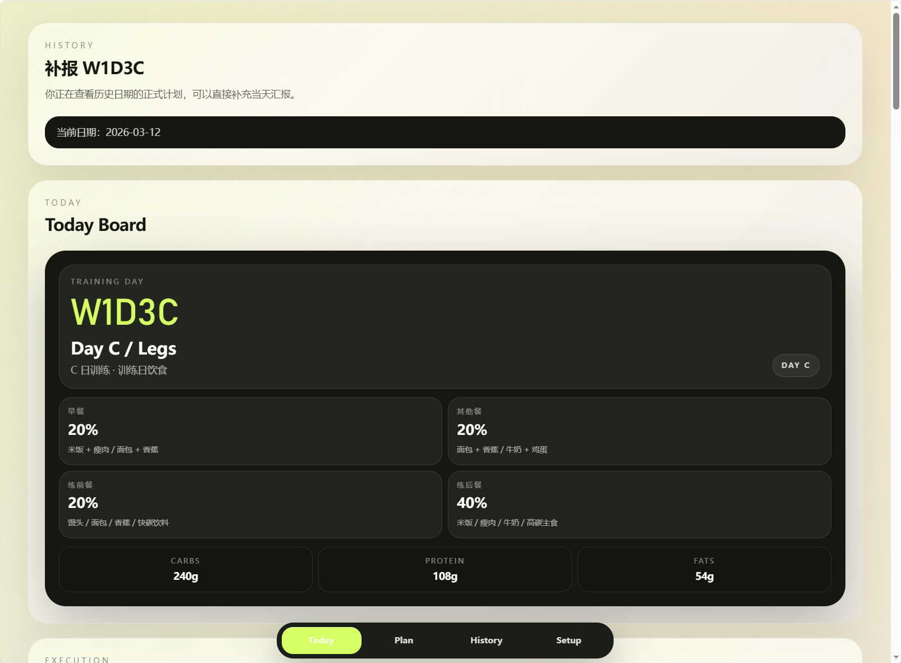
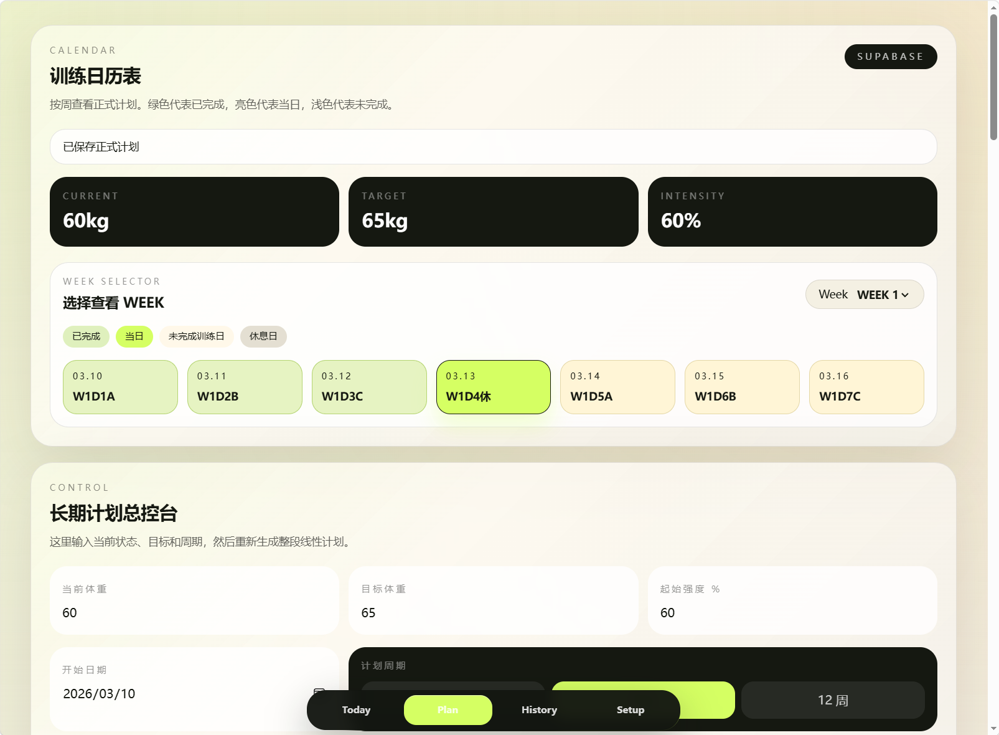
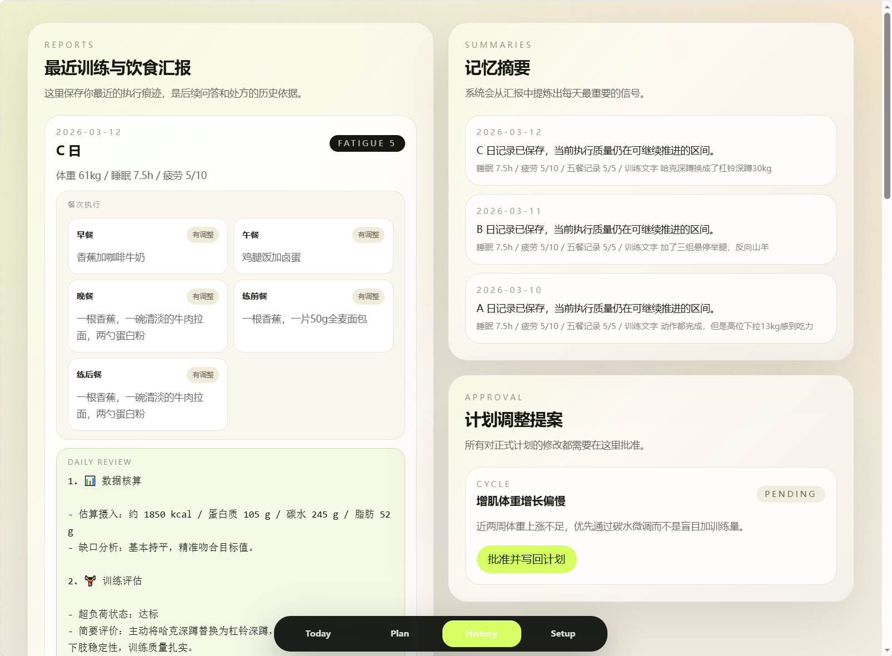

# FitCoach

FitCoach 是一个移动优先的健身辅助记录系统，目标不是“陪聊”，而是把长期训练计划、当天处方、训练/饮食执行、短期记忆和理论问答串成一个闭环。

当前版本已经支持：

1. 配置长期计划与 A / B / C 模板
2. 自动生成当天训练和饮食处方
3. 结构化回填训练与饮食执行结果
4. 自动生成当日点评和次日决策建议
5. 在历史记录、短期记忆、知识库和计划提案之间联动

## 界面预览

### Today 页面



### 计划页



### 历史页



## 1. 当前核心能力

### 长期计划

- 编辑体重、目标、阶段、周期、起始强度
- 维护 A / B / C 三天训练模板
- 自动生成训练日历和线性推进计划
- 保存后同步生成计划快照，供历史补报使用

### Today 页面

- 按当天日期或历史日期生成训练卡与饮食卡
- 训练日展示动作处方和重量建议
- 休息日展示恢复和饮食执行建议
- 支持历史日期补报

### 日报回填（本轮升级重点）

- 训练记录从“单段文本”升级为“混合结构化”
- 动作执行支持记录：
  - 是否完成
  - 实际组数
  - 实际次数
  - 顶组重量
  - RPE
  - 是否掉组
  - 动作备注
- 餐次执行支持记录：
  - 早餐 / 午餐 / 晚餐 / 练前餐 / 练后餐
  - 每餐内容
  - 执行状态：`on_plan` / `adjusted` / `missed`
  - 偏差说明
  - 午餐 / 晚餐兼练后餐
- 恢复指标支持记录：
  - 体重
  - 睡眠
  - 疲劳
  - 疼痛备注
  - 恢复备注
- 保留自由总结备注，补充结构化字段之外的上下文

### 自动点评与次日决策

提交日报后，会生成固定四段式点评：

1. 数据摘要
2. 训练评估
3. 饮食执行
4. 次日决策

其中次日决策包含：

- `trainingReadiness`: `push` / `hold` / `deload`
- `nutritionFocus`
- `recoveryFocus`
- `priorityNotes`

规则引擎优先生成稳定结构；若配置了 Gemini，则在不改变结构的前提下做文案润色。

### 历史页

- 查看最近训练和饮食汇报
- 查看结构化动作执行和餐次状态
- 查看自动点评与次日决策
- 查看短期记忆摘要
- 查看并批准计划调整提案

### 理论问答

- 会结合知识库、近期历史记录和当前正式计划回答问题
- 未配置 Gemini 时回退到规则化回答
- 不会直接修改正式计划，只会给建议

### 双后端模式

- `Mock`
  - 默认可直接运行
  - 适合本地演示
  - 进程重启后数据丢失
- `Supabase`
  - 配置环境变量后启用
  - 提供持久化数据存储
  - 适合真实长期使用

### 运行状态检查

- 页面：`/setup`
- API：`GET /api/status`

这两个入口用于快速判断当前实例是否已经从演示态进入真实可长期使用态。

## 2. 技术栈

- Next.js 16 + App Router
- React 19
- TypeScript
- Tailwind CSS 4
- Supabase（可选）
- Gemini API（可选）
- Vitest

## 3. 项目结构

```text
fitcoach-web/
├─ content/
│  └─ knowledge/                 # 默认知识库 Markdown
├─ scripts/
│  ├─ import-knowledge.mjs       # 导入知识库
│  └─ reset-runtime-data.mjs     # 重置运行时数据
├─ src/
│  ├─ app/                       # Next.js 页面与 API
│  ├─ components/                # UI 组件
│  └─ lib/
│     ├─ server/                 # 领域逻辑、仓储、状态与模型接入
│     ├─ session-report.ts       # 结构化日报辅助逻辑
│     ├─ types.ts                # 核心类型
│     └─ validations.ts          # Zod 校验
├─ supabase/
│  └─ schema.sql                 # 数据库初始化与增量迁移
└─ test/
```

## 4. 关键页面与接口

### 页面

- `/`
  - 今日处方 + 日报回填 + 教练问答
- `/plan`
  - 长期计划总控台
- `/history`
  - 历史汇报、记忆摘要、调整提案
- `/setup`
  - 运行状态检查页
- `/unlock`
  - 公网门禁页

### API

- `POST /api/plan/setup`
- `POST /api/daily-brief/generate`
- `POST /api/session-report`
- `POST /api/assistant/chat`
- `POST /api/plan-adjustments/:id/approve`
- `POST /api/knowledge/import`
- `GET /api/status`

## 5. 本地启动

当前项目目录：

```bash
cd H:\other\workspeace\FitCoach\fitcoach-web
```

### 方式 A：直接使用 Node 环境

```bash
npm install
npm run dev
```

### 方式 B：使用本机已存在的 conda 环境

当前机器已经有 `fitcoach` 环境，内部带 Node 20。

```bash
conda activate fitcoach
npm install
npm run dev
```

如果你在 Windows 上通过脚本调用命令，建议显式确保 `fitcoach` 环境下的 Node 在 PATH 中。

## 6. 环境变量

复制 `.env.example` 为 `.env.local`：

```env
GEMINI_API_KEY=
GEMINI_MODEL=gemini-2.0-flash
SUPABASE_URL=
SUPABASE_SERVICE_ROLE_KEY=
FITCOACH_ACCESS_TOKEN=
```

说明：

- 不填 `SUPABASE_URL` / `SUPABASE_SERVICE_ROLE_KEY`
  - 自动进入 `Mock` 模式
- 填了 Supabase 变量
  - 自动切换到 `Supabase` 持久化模式
- 不填 `GEMINI_API_KEY`
  - 问答与点评回退到规则逻辑
- 填 `FITCOACH_ACCESS_TOKEN`
  - 公网部署时启用单用户访问门禁

## 7. Supabase 初始化与迁移

在 Supabase SQL Editor 执行：

- `supabase/schema.sql`

本轮结构化日报升级后，除了原来的 `session_reports.report` 聚合 JSON，还新增了两张子表：

- `session_report_exercises`
- `session_report_meals`

并为 `session_reports` 增加了头部字段：

- `report_version`
- `report_date`
- `performed_day`
- `body_weight_kg`
- `sleep_hours`
- `fatigue`
- `completed`
- `training_readiness`

### 迁移策略

- 只做增量兼容迁移
- 不删除旧字段
- 历史 `report jsonb` 仍然可读
- 新日报会同时写聚合 JSON 和子表明细

### 初始化后应检查

- `session_reports` 表存在
- `session_report_exercises` 表存在
- `session_report_meals` 表存在
- `/setup` 页显示 `storageMode = supabase`

## 8. 知识库导入

默认知识库文件：

- `content/knowledge/fitness-core-theory.md`

导入方式：

```bash
npm run knowledge:import
```

也可以直接调用：

- `POST /api/knowledge/import`
- `GET /api/status`

如果知识库为空，`/setup` 页面会显示告警，理论问答质量会明显下降。

## 9. 数据模型说明

### 结构化日报 v2

`SessionReport` 当前支持：

- `reportVersion`
- `performedDay`
- `exerciseResults[]`
- `mealLog`
- `bodyWeightKg`
- `sleepHours`
- `fatigue`
- `painNotes`
- `recoveryNote`
- `trainingReportText`
- `nextDayDecision`
- `dailyReviewMarkdown`

### 饮食记录

`mealLog` 不再是纯字符串集合，而是固定餐次对象：

```ts
{
  breakfast: { content, adherence, deviationNote? }
  lunch: { content, adherence, deviationNote? }
  dinner: { content, adherence, deviationNote? }
  preWorkout: { content, adherence, deviationNote? }
  postWorkout: { content, adherence, deviationNote? }
  postWorkoutSource: "dedicated" | "lunch" | "dinner"
}
```

### 向后兼容

旧版日报仍可读取：

- 旧版字符串型 `mealLog` 会在服务端自动归一化
- 缺失 `nextDayDecision` 的历史记录不会报错
- History 页面对旧数据继续保留兜底展示

## 10. Vercel 部署

### 基础步骤

1. 推送代码到 GitHub
2. 在 Vercel 导入仓库
3. 配置环境变量
4. 重新部署
5. 执行 Supabase 最新 `schema.sql`

### Vercel 必配环境变量

- `SUPABASE_URL`
- `SUPABASE_SERVICE_ROLE_KEY`
- `FITCOACH_ACCESS_TOKEN`

建议同时配置：

- `GEMINI_API_KEY`
- `GEMINI_MODEL`

### 部署后第一件事

打开：

- `/setup`

确认：

- `storageMode = supabase`
- `knowledgeChunks > 0`
- `Access Gate = enabled`
- 没有关键 warning

## 11. 部署后的验证清单

### 运行状态验证

- 打开 `/setup`
- 确认不是 `Mock`
- 确认知识库已导入
- 确认门禁已启用

### 数据写入验证

提交一条训练日报后，在 Supabase 检查：

- `session_reports` 有新记录
- `session_report_exercises` 有动作明细
- `session_report_meals` 有餐次明细

### 功能链路验证

1. 首页能显示 Today Board
2. 训练日报能成功提交
3. 提交后返回四段式点评
4. 刷新后数据仍在
5. `/history` 能看到动作、餐次、次日决策
6. 休息日日报可提交且不要求动作
7. 教练问答接口正常
8. 无痕访问时门禁正常

## 12. 验证命令

```bash
npm run lint
npm run test
npm run build
```

当前主线版本这三项均已通过。

## 13. 测试覆盖重点

当前测试已覆盖：

- 训练顺位推进
- 每日处方生成
- 高疲劳触发减载提案
- 次日决策生成
- v2 结构化日报校验
- 旧版日报兼容归一化
- 训练日缺失动作明细时报错

## 14. 当前已知边界

- 次日决策目前只给建议，不会自动改正式计划
- 正式计划修改仍然必须通过提案批准流
- Gemini 不是必需项，但未配置时点评和问答更偏规则化
- 知识库本轮没有重新设计导入逻辑，只沿用现有 Markdown 分块方案

## 15. 推荐使用顺序

如果你准备开始长期实际使用，建议按下面顺序：

1. 先执行 Supabase `schema.sql`
2. 配好 Vercel 环境变量
3. 打开 `/setup` 清空告警
4. 在 `/plan` 校准正式计划
5. 回到 `/` 开始每天记录
6. 在 `/history` 审核系统提案
